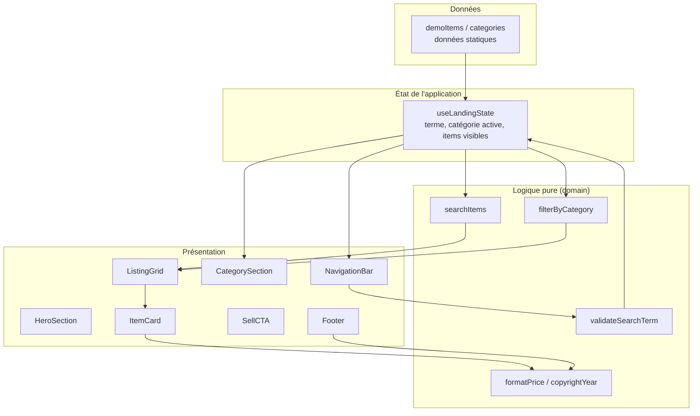

# Design Document

## Overview

Cette fonctionnalité réalise une landing page de type Vinted : une vitrine statique côté front-end pour une marketplace de seconde main. La page est composée d'une barre de navigation fixe avec recherche, d'une section hero, d'une navigation par catégories, d'une grille de listings d'articles, d'un appel à l'action de vente, et d'un pied de page. L'ensemble est responsive entre 320 et 1920 pixels de largeur.

Le périmètre est strictement front-end : aucune persistance serveur, aucune authentification, aucune API distante. Les articles affichés proviennent d'un jeu de **données de démonstration** chargé en mémoire au démarrage de l'application.

### Objectifs de conception

- Séparer clairement la **logique pure** (filtrage par recherche, filtrage par catégorie, validation de saisie, formatage) des **composants de présentation** (rendu, mise en page responsive, animations).
- Rendre la logique de filtrage et de validation testable de façon déterministe et exhaustive (tests basés sur les propriétés).
- Garantir une expérience responsive et accessible (taille de police minimale, absence de défilement horizontal).

### Décisions techniques et justifications

| Décision | Choix | Justification |
|---|---|---|
| Framework UI | React + TypeScript | Composants réutilisables, typage fort des modèles de données (Item, Category), écosystème de test mature. |
| Outil de build | Vite | Démarrage rapide, support TypeScript natif, build statique déployable tel quel. |
| Styles | CSS Modules + variables CSS | Encapsulation par composant, points de rupture responsives centralisés, pas de dépendance lourde. |
| Tests unitaires | Vitest | Intégration native avec Vite, API compatible Jest. |
| Tests de propriétés | fast-check | Bibliothèque de property-based testing de référence pour TypeScript/JavaScript. |
| Données | Jeu de démonstration statique (TypeScript) | Aucun back-end requis dans le périmètre ; les données alimentent directement les fonctions pures. |

## Architecture

L'application suit une architecture en couches qui isole la logique métier pure de la couche de présentation. C'est cette séparation qui permet de tester les comportements de filtrage et de validation sans dépendre du rendu du DOM.



### Flux principaux

1. **Recherche** : le `Search_Component` capture le terme, `validateSearchTerm` vérifie la longueur, puis `searchItems` produit la liste filtrée transmise à `ListingGrid`.
2. **Catégorie** : l'activation d'une catégorie met à jour la catégorie active dans l'état, `filterByCategory` recalcule les items visibles. La réactivation de la catégorie active réinitialise le filtre.
3. **Rendu de la grille** : `ListingGrid` reçoit la liste d'items visibles et décide de l'état affiché (cartes, message « peu d'articles », message « aucun article », message « aucun article trouvé »).
4. **Navigation fluide** : le clic sur le logo ou le CTA hero déclenche un défilement fluide vers une cible (`top` ou `Sell_CTA`).

### Points de rupture responsives

| Point de rupture | Largeur de Viewport | Comportement |
|---|---|---|
| Mobile | < 768 px | Menu compact (burger), grille 1 colonne. |
| Desktop | ≥ 768 px | Navigation étendue, grille ≥ 3 colonnes. |

Une variable CSS centralise le point de rupture (`--breakpoint-md: 768px`). La largeur des images est contrainte par `max-width: 100%`. La taille de police de base est fixée à `≥ 14px` via une variable CSS et des unités relatives.

## Components and Interfaces

### Couche logique pure (`src/domain/`)

```typescript
// Filtrage par recherche
// Retourne les items dont le titre OU la marque contient `term` (sous-chaîne, insensible à la casse).
// Un terme vide ou composé uniquement d'espaces retourne tous les items.
function searchItems(items: Item[], term: string): Item[];

// Filtrage par catégorie
// Si categoryId est null, retourne tous les items. Sinon, retourne uniquement
// les items dont le champ categoryId correspond.
function filterByCategory(items: Item[], categoryId: string | null): Item[];

// Validation du terme de recherche
type SearchValidation =
  | { kind: "valid"; normalized: string }
  | { kind: "tooLong"; max: 100 };

function validateSearchTerm(term: string): SearchValidation;

// Formatage du prix en chaîne d'affichage non vide (ex. "12,00 €")
function formatPrice(amountCents: number): string;

// Année de copyright à quatre chiffres à partir d'une date
function copyrightYear(now: Date): string;

// Sélection/bascule de catégorie : renvoie la prochaine catégorie active
// (null si la catégorie cliquée est déjà active — comportement de bascule).
function toggleCategory(active: string | null, clicked: string): string | null;
```

### Couche d'état (`src/state/`)

```typescript
interface LandingState {
  searchTerm: string;        // terme courant conservé dans le champ
  activeCategory: string | null;
  visibleItems: Item[];      // résultat dérivé du filtrage courant
  searchError: string | null;
}

// Hook React centralisant les transitions d'état
function useLandingState(allItems: Item[]): {
  state: LandingState;
  submitSearch: (term: string) => void;
  selectCategory: (categoryId: string) => void;
  resetFilters: () => void;
};
```

### Couche de présentation (`src/components/`)

| Composant | Responsabilité | Entrées principales |
|---|---|---|
| `NavigationBar` | Logo, recherche, boutons d'action, menu compact responsive, position fixe. | `onSearch`, `onLogoClick`, `isMobile` |
| `SearchComponent` | Champ de saisie, placeholder, affichage d'erreur de longueur. | `value`, `error`, `onSubmit` |
| `HeroSection` | Titre, sous-titre, CTA principal, défilement vers Sell_CTA. | `onPrimaryCta` |
| `CategorySection` | Liste des catégories, indication visuelle de la catégorie active. | `categories`, `activeCategory`, `onSelect` |
| `ListingGrid` | Disposition responsive, sélection de l'état d'affichage (cartes/messages). | `items`, `searchTerm`, `mode` |
| `ItemCard` | Image (avec fallback), titre, marque, taille, prix ; effet de survol. | `item` |
| `SellCTA` | Titre, étapes ordonnées (2 à 5), bouton « Commence à vendre ». | `onStartSelling` |
| `Footer` | Trois groupes de liens, liens sociaux (1 à 6), copyright. | `links`, `socialLinks`, `year` |

### Interfaces de défilement

```typescript
// Défile jusqu'à la position 0 en ≤ 1s (comportement fluide).
function scrollToTop(): void;

// Défile jusqu'à la cible Sell_CTA en < 1000 ms.
// Retourne false si la cible est introuvable (l'appelant affiche alors une indication).
function scrollToSellCta(): boolean;
```

## Data Models

### Item

```typescript
interface Item {
  id: string;            // identifiant unique non vide
  title: string;         // titre non vide
  brand: string;         // marque non vide
  size: string;          // taille non vide
  priceCents: number;    // prix en centimes, entier >= 0
  imageUrl: string;      // URL de l'image
  categoryId: string;    // référence vers Category.id
}
```

Règle de cohérence : tout `Item.categoryId` référence un `Category.id` existant. La carte affiche un prix formaté non vide dérivé de `priceCents`.

### Category

```typescript
interface Category {
  id: string;            // identifiant unique non vide
  label: string;         // libellé non vide, longueur <= 40 caractères
  visual: string;        // icône ou image non vide
}
```

Le jeu de catégories de démonstration contient entre 5 et 20 catégories (cf. R4.1).

### FooterLinkGroup / SocialLink

```typescript
interface FooterLinkGroup {
  label: "À propos" | "Aide" | "Mentions légales";
  links: { label: string; href: string }[];
}

interface SocialLink {
  platform: string;
  href: string;
}
```

### État d'affichage de la grille

```typescript
type GridMode =
  | { kind: "items" }              // >= 8 items disponibles, affichage normal
  | { kind: "few"; count: number } // 1..7 items au chargement initial
  | { kind: "empty" }              // 0 item disponible au chargement
  | { kind: "noResults" };         // filtre/recherche sans correspondance
```

### Jeu de données de démonstration

Le jeu de démonstration fournit au moins 8 items (pour satisfaire R5.1) répartis sur les catégories. Chaque item a des champs non vides ; au moins un item référence chaque catégorie affichée, et au moins une catégorie reste sans item pour valider le message « aucun article pour cette catégorie » (R4.3) dans les tests.

## Correctness Properties

*Une propriété est une caractéristique ou un comportement qui doit rester vrai pour toutes les exécutions valides d'un système — essentiellement, un énoncé formel de ce que le système doit faire. Les propriétés servent de pont entre les spécifications lisibles par l'humain et les garanties de correction vérifiables par la machine.*

Le périmètre est une vitrine statique : beaucoup de critères concernent la mise en page responsive, des contenus statiques ou des interactions ponctuelles (couverts par des tests d'exemple, de snapshot ou de mise en page). Les propriétés ci-dessous ciblent la **logique pure** — filtrage, validation, bascule et formatage — où une quantification universelle « pour tout » a un sens et où la variation des entrées révèle des cas limites.

### Property 1: Justesse et complétude de la recherche

*Pour tout* ensemble d'items et tout terme de recherche non vide (1 à 100 caractères), `searchItems` renvoie exactement les items dont le titre ou la marque contient le terme en tant que sous-chaîne sans tenir compte de la casse : chaque item renvoyé correspond, et tout item correspondant est renvoyé.

**Validates: Requirements 2.2**

### Property 2: Une recherche vide ou blanche renvoie tous les items

*Pour tout* ensemble d'items et toute chaîne composée uniquement de caractères d'espacement (y compris la chaîne vide), `searchItems` renvoie l'ensemble complet des items, dans le même ordre.

**Validates: Requirements 2.4**

### Property 3: Validation de la longueur du terme de recherche

*Pour toute* chaîne de caractères, `validateSearchTerm` renvoie `tooLong` si et seulement si sa longueur est strictement supérieure à 100 caractères ; sinon elle renvoie `valid`.

**Validates: Requirements 2.5**

### Property 4: Invariants du jeu de catégories

*Pour toute* catégorie du jeu de catégories affiché, son libellé est non vide et d'au plus 40 caractères et sa représentation visuelle est non vide ; et le nombre total de catégories est compris entre 5 et 20 inclus.

**Validates: Requirements 4.1**

### Property 5: Justesse et complétude du filtre par catégorie

*Pour tout* ensemble d'items et tout identifiant de catégorie, `filterByCategory` renvoie exactement les items dont le `categoryId` correspond à l'identifiant : chaque item renvoyé appartient à la catégorie, et tout item de la catégorie est renvoyé.

**Validates: Requirements 4.2**

### Property 6: La bascule de catégorie garde au plus une catégorie active et réinitialise à la réactivation

*Pour toute* catégorie active courante et toute catégorie cliquée, `toggleCategory` renvoie `null` lorsque la catégorie cliquée est déjà active (réactivation → aucun filtre → tous les items) et renvoie la catégorie cliquée sinon ; le résultat désigne donc toujours au plus une catégorie active.

**Validates: Requirements 4.4, 4.5**

### Property 7: Complétude du rendu d'une Item_Card

*Pour tout* item valide, la `Item_Card` rendue contient une image, le titre, la marque, la taille et un prix formaté, chacun avec une valeur non vide.

**Validates: Requirements 5.2**

### Property 8: Format de l'année de copyright

*Pour toute* date, `copyrightYear` renvoie une chaîne de exactement quatre chiffres égale à l'année de cette date.

**Validates: Requirements 7.3**

### Property 9: La bascule du menu compact est involutive

*Pour tout* état d'ouverture du menu compact, appliquer la bascule deux fois consécutives restaure l'état d'origine, et l'appliquer une fois inverse l'état.

**Validates: Requirements 8.5**

## Error Handling

| Situation | Comportement attendu | Référence |
|---|---|---|
| Terme de recherche > 100 caractères | Soumission empêchée, texte conservé, message de longueur maximale dépassée affiché. | R2.5 |
| Recherche sans correspondance | Message « Aucun article trouvé » affiché, terme conservé dans le champ. | R2.3 |
| Catégorie sélectionnée sans item | Message d'absence d'item pour la catégorie, `Category_Section` conservée visible. | R4.3 |
| Moins de 8 items au chargement | Une `Item_Card` par item disponible + message indiquant le nombre limité. | R5.6 |
| Aucun item disponible | Message d'absence d'articles, aucune `Item_Card` affichée. | R5.7 |
| Image d'item indisponible | Image de remplacement (fallback) affichée via le gestionnaire `onError` de l'image. | R5.8 |
| CTA hero alors que `Sell_CTA` introuvable | Position de défilement conservée + indication visuelle de cible indisponible. | R3.5 |
| Lien de footer vers ressource indisponible | Message d'erreur d'inaccessibilité affiché, pied de page conservé. | R7.5 |

Principes :
- Les fonctions pures (`searchItems`, `filterByCategory`, `validateSearchTerm`) ne lèvent pas d'exception : elles renvoient des valeurs ou des résultats typés (`SearchValidation`, `GridMode`) que la couche de présentation interprète.
- Les états « vide / aucun résultat / peu d'articles » sont modélisés explicitement par `GridMode` afin d'éviter les branches implicites dans le rendu.
- Les échecs de chargement d'image sont gérés localement par `ItemCard` sans interrompre le rendu de la grille.

## Testing Strategy

Approche duale : tests unitaires/d'exemple pour les comportements concrets et les cas limites, tests de propriétés pour les garanties universelles sur la logique pure, et tests de mise en page/snapshot pour le responsive.

### Tests de propriétés (fast-check, Vitest)

- Bibliothèque : **fast-check**. La logique de propriété n'est pas réimplémentée à la main.
- Chaque test de propriété s'exécute sur **au minimum 100 itérations** (`{ numRuns: 100 }`).
- Chaque test est étiqueté par un commentaire référençant la propriété du design, au format :
  `// Feature: vinted-landing-page, Property {numéro}: {texte de la propriété}`
- Chaque propriété de correction est implémentée par **un seul** test de propriété.

Couverture des propriétés :

| Propriété | Cible de test | Générateurs |
|---|---|---|
| 1 — Justesse/complétude recherche | `searchItems` | tableaux d'`Item`, terme dérivé d'une sous-chaîne ou aléatoire |
| 2 — Recherche blanche → tous | `searchItems` | tableaux d'`Item`, chaînes d'espaces variées |
| 3 — Validation de longueur | `validateSearchTerm` | chaînes de longueurs réparties autour de 100 |
| 4 — Invariants catégories | jeu de `Category` | parcours du jeu de démonstration |
| 5 — Filtre par catégorie | `filterByCategory` | tableaux d'`Item`, `categoryId` |
| 6 — Bascule de catégorie | `toggleCategory` | catégorie active nullable + catégorie cliquée |
| 7 — Rendu Item_Card | `ItemCard` (Testing Library) | `Item` aléatoires non vides |
| 8 — Année de copyright | `copyrightYear` | dates aléatoires |
| 9 — Bascule menu involutive | logique de bascule booléenne | booléen initial |

### Tests unitaires et d'exemple

- Contenus statiques et libellés : logo (R1.1), boutons (R1.3, R1.4, R6.2), placeholder (R2.1), titres/sous-titres hero et sell (R3.1, R3.2, R6.1), étapes de vente (R6.3), groupes et liens de footer (R7.1, R7.2, R7.4).
- Cas limites de la grille : aucun résultat (R2.3), catégorie vide (R4.3), 1 à 7 items (R5.6), 0 item (R5.7), fallback image (R5.8).
- Interactions : clic logo → `scrollToTop` (R1.6), CTA hero → `scrollToSellCta` (R3.4), cible absente (R3.5), redirection vente (R6.4), ressource footer indisponible (R7.5), bascule du menu (R8.5).

### Tests de mise en page et snapshot (responsive)

- Grille 1 colonne < 768 px et ≥ 3 colonnes ≥ 768 px (R5.3, R5.4).
- Navigation : menu compact < 768 px, navigation étendue ≥ 768 px (R8.1, R8.4).
- Barre fixe au défilement (R1.5), hero au-dessus de la ligne de flottaison (R3.3), effet de survol des cartes (R5.5).
- Absence de défilement horizontal et contrainte `max-width` des images entre 320 et 1920 px (R8.2, R8.3), taille de police ≥ 14 px (R8.6).

Ces critères relèvent de la présentation/CSS et ne sont pas des fonctions à entrées/sorties ; ils sont validés par des tests de rendu et de mise en page plutôt que par des tests de propriétés.
